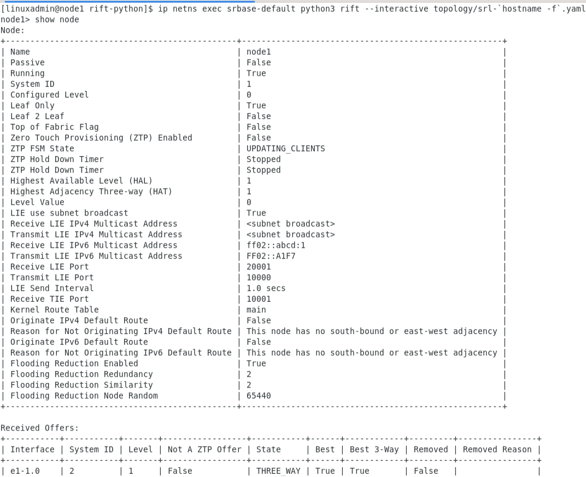

# Evaluating Routing In Fat Trees (RIFT) on SR Linux


Juniper Networks came up with their own version of a routing protocol, called Routing In Fat Trees (RIFT). It is [available for evaluation here](https://support.juniper.net/support/downloads/?p=rifteval). An open source version based on Python is [in the works](https://github.com/brunorijsman/rift-python).

Unfortunately, as I discovered (on 2021-08-10) access to the RIFT evaluation software is restricted to registered Juniper customers. Therefore, the open source prototype will have to do for now - and OMMV.

# Installation instructions
```
git clone --recurse-submodules https://github.com/jbemmel/srl-openrift.git
cd srl-openrift
make build
sudo containerlab deploy -t ./srl-leafspine.lab --reconfigure
```

# Testing RIFT using subnet broadcast
```
ssh linuxadmin@clab-openrift-lab-node1
cd /opt/rift-python/
ip netns exec srbase-default python3 rift --interactive topology/srl-`hostname -f`.yaml
```


[Pull request]( https://github.com/brunorijsman/rift-python/pull/110 ) submitted
